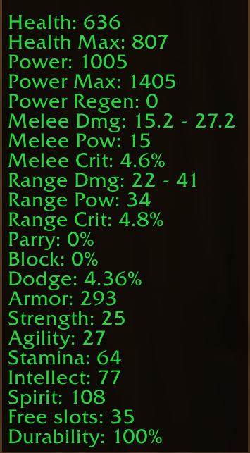
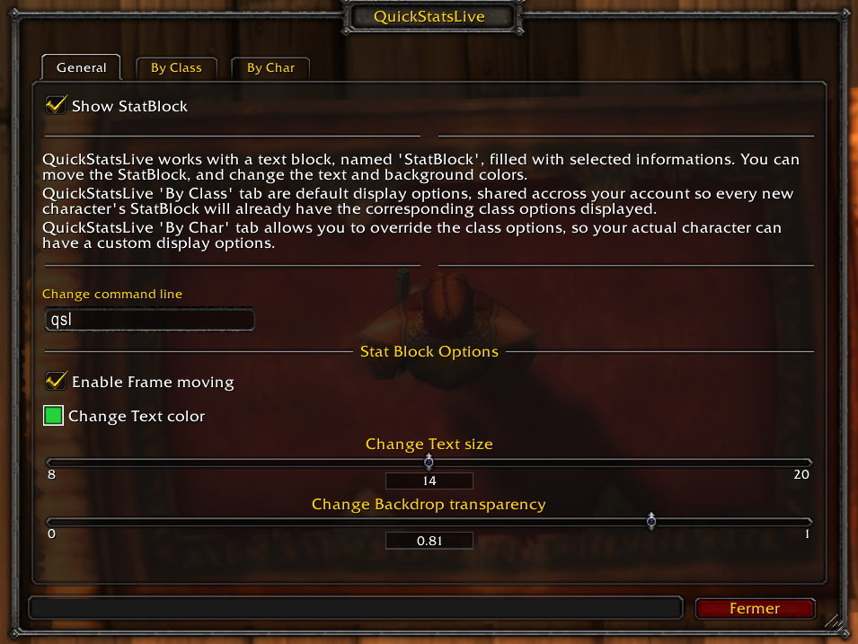

QuickStatsLive
##############

Addon for World Of Warcraft.
Display a frame with customizable statistics

Supported Games
===============
* WoW Classic

Configuration of the addon
==========================
* Use the tchat command and type **/quickstatslive** _(default value)_
* Use Blizzard Menu with Esc > Interface > Add-ons tab > QuickStatsLive

* The **General** tab configure the addon as a whole
    * Show / Hide the Stat block
    * Change the command line
    * Lock the Stat block
    * Customize the text color
    * Customize the backdrop transparency

* The **By Class** tab setup the addon for each classes, its configuration is shared across all the characters

* The **By Char** tab setup the addon for the currently played character, its configuration is local

.. image:: Assets/bychar_frame.png
    :scale: 80

You can choose to override the **By Class** configuration with the **By Char** configuration, allowing you to have a default template and a custom experience at will.

How it renders in game
======================

.. image:: Assets/full_screen.png
    :scale: 50